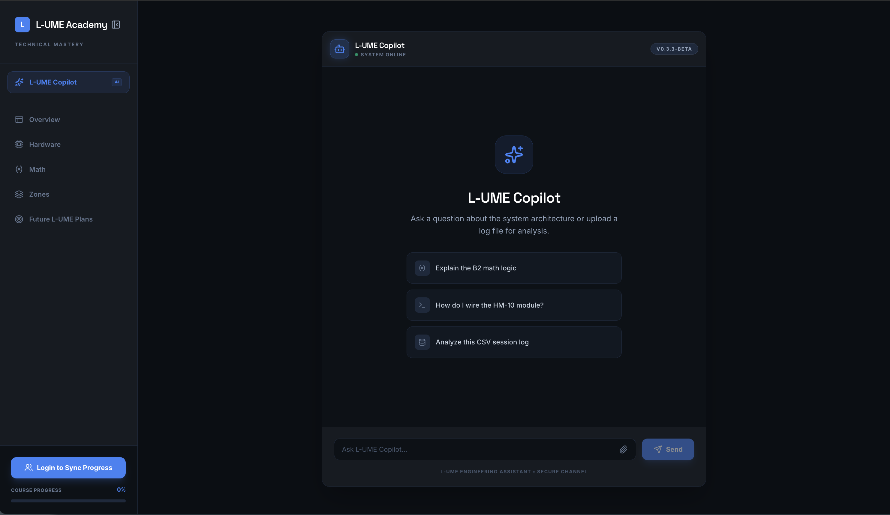

# The L-UME Website
Technical Mastery · System Architecture · Log Analysis  
Central documentation and engineering assistant for the L-UME ecosystem.

## Overview
**L-UME Academy** serves as the educational and technical hub for the L-UME project. It is designed to guide users and engineers through the system's architecture, from the core B2 math logic to real-time IMU data interpretation.

---

## Technical Access
The primary website and assistant platform is hosted on AI Studio:

**[Enter The L-UME Website](https://l-ume-academy-137805559096.us-east1.run.app/)**

---

## Why "L-UME Academy"?
While this is the primary **L-UME Website**, the name **L-UME Academy** is utilized to emphasize the platform's role as an educational resource. It is structured to facilitate:
- **Technical Onboarding:** Teaching the underlying math and firmware logic.
- **Mastery of Data:** Providing the tools needed to analyze motion logs.
- **Systematic Learning:** Guiding developers through the evolution of the wearable hardware.

---

## L-UME Copilot
The website features the **L-UME Copilot**, a specialized assistant trained on the project's technical specifications.

**Capabilities**
- **Architecture Analysis:** Explains B2 math logic and IMU zone mapping.
- **Hardware Guidance:** Provides wiring schematics for components like the HM-10 Bluetooth module.
- **Log Interpretation:** Analyzes uploaded CSV session logs to provide performance insights.

---

_Last updated April 25th 2026_
